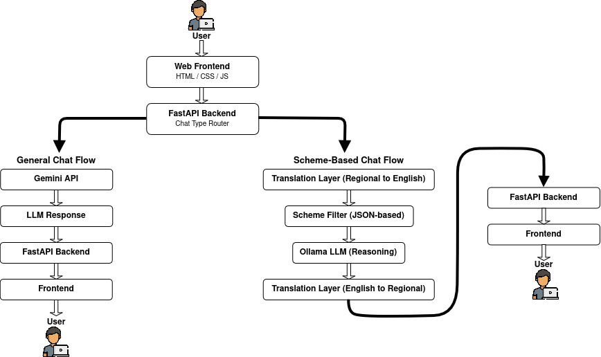

# What is NEGen?
**NEGen** is an AI-powered Assistant designed specifically for **Northeast India**, designed to help users discover and understand **government, education, and health schemes**.

The platform also provides a **general AI chat** experience in a regional language, making information more accessible to local users.

**NEGen** allows users to interact through a simple chat in their **regional language**, making information accessible and easier to understand.

The goal is to simplify access to public information for people who struggle with complex government portals and language barriers.

**NEGen** allows users to:
- Ask about government schemes
- Understand eligibility and benefits
- Chat in regional language
- Get responses conversationally

The system separates **general conversation** and **scheme-based chat** to ensure accurate, reliable, and context-aware responses.

> Note: NEGen is currently a prototype system and under active development.

---
## Problem Statement
Accessing government schemes and reliable information remains difficult for many citizens in **Northeast India** due to:
- Complex government portals
- Information scattered across websites
- Language barriers (English/Hindi dominance)
- Difficulty understanding scheme eligibility
- Lack of regional-language AI assistance

**NEGen** solves this by making scheme access conversational.

---
## Core Features
### 1. Scheme-Based Chat
Users can:
- Select state
- Select domain (Government/Education/Health)
- Choose scheme
- Ask questions conversationally

Example:
- Benefits?
- Eligibility?
- Documents required?

---

### 2. General Chat
Users can chat in regional language for:
- General assistance
- Basic questions
- Everyday queries

---
## Architecture Overview



---
## Tech Stack

### Backend
- Python
- FastAPI
- Uvicorn

> Note: FastAPI internally uses Pydantic for request validation.

### Frontend
- HTML
- CSS
- JavaScript
### AI Models
- Gemini (gemini-3-flash-preview) → General chat + translation
- Ollama LLaMA 3.2 → Scheme reasoning
### Storage
- JSON-based scheme data

---
## API Endpoints

### GET /api/schemes
Fetches available schemes based on selected state and domain.

**Query Parameters:**
- `mode` – Scheme category (`government`, `education`, `health`)
- `state` – State name (e.g., `meghalaya`)

---

### POST /api/chat
Handles both general chat and scheme-based chat.

- Used for:
  - General conversational queries (Ask NEGen)
  - Scheme-specific questions after selecting a scheme

---
## Chat Payload Structure

The frontend communicates with the backend using JSON payloads sent to the `/api/chat` endpoint.

### Example: Scheme Chat Payload

```json
{
  "chat_type": "scheme_chat",
  "language": "garo",
  "domain": "government",
  "state": "meghalaya",
  "scheme_id": "SCH001",
  "question": "What benefits does this scheme provide?"
}
```
### Example: General Chat Payload

```json
{
  "chat_type": "general_chat",
  "language": "garo",
  "question": "How are you?"
}
```
### Payload Fields

| Field | Description |
|-------|-------------|
| chat_type | Type of chat: general_chat or scheme_chat |
| language | Selected regional language |
| domain | Scheme category (government, education, health) |
| state | Selected state name |
| scheme_id | Selected scheme identifier |
| question | User query message |

### Notes
- domain, state, and scheme_id are required only for scheme_chat.
- general_chat only requires chat_type, language, and question.
- Language selection determines which translation module is used.

---
## ⚙ Pipeline Logic

### 1. Scheme Chat Steps
1. Receive payload
2. Translate to English
3. Fetch scheme data
4. Run reasoning model
5. Translate response back
6. Send response
### 2. General Chat Steps
1. Receive payload
2. Direct Gemini call
3. Return response

---
## Important Code Sections

### Pipeline Code
```python
import asyncio
import json

# importing llm and translation helpers
from services.llm.llm import gemini_general
from services.llm.registry import get_llm
from services.translation.registry import get_translator

# creating translator and llm instance
translator = get_translator()
llm = get_llm()


# function to load data from schemes.json
def load_data():
    with open("data/schemes.json", "r") as f:
        return json.load(f)


# loading data once when server starts
data = load_data()


# function to search scheme by scheme id,state and domain
def search_scheme(data, scheme_id, state, domain):
    try:
        data = data[state][domain]
    except KeyError:
        return None

    # searching for scheme id in data
    for scheme in data:
        if scheme["id"] == scheme_id:
            scheme = scheme
            return scheme
    return None


# function to handle scheme-based chat flow
async def scheme_chat(payload):
    # storing values from payload
    domain = payload.domain.strip().lower()
    scheme_id = payload.scheme_id
    state = payload.state.strip().lower()
    question = payload.question

    # translating question from local language to english
    question = await asyncio.to_thread(translator.translate_to_english, question)

    # calling search_scheme function to get scheme by id
    scheme = search_scheme(data, scheme_id, state, domain)
    if scheme is None:
        return {"answer": "Scheme not found for the given ID, state, and domain."}

    # generate answer using scheme data
    answer = await asyncio.to_thread(llm.generate, scheme, question, domain)

    # translating answer from english language to local
    answer = await asyncio.to_thread(translator.translate_to_local, answer)

    return {"answer": f"{answer}"}


# function to handle general chat
async def general_chat(payload):
    question = payload.question

    # call gemini for general chat
    answer = await asyncio.to_thread(gemini_general, question)
    return {"answer": f"{answer}"}
```

### FastAPI Routes
```python
from fastapi import FastAPI
from fastapi.middleware.cors import CORSMiddleware

# importing API routers
from routes.chat import router as chat_router
from routes.schemes import router as schemes_router

app = FastAPI(title="NEGen")

# enable CORS so frontend can all backend
app.add_middleware(
    CORSMiddleware,
    allow_origins=["*"],
    allow_credentials=True,
    allow_methods=["GET", "POST", "OPTIONS"],
    allow_headers=["*"],
)

# register API routes
app.include_router(schemes_router, prefix="/api")
app.include_router(chat_router, prefix="/api")


# basic root endpoint
@app.get("/")
def root():
    return {"project": "NEGen", "status": "running", "docs": "/docs"}

```

#### Chat Router
```python
import asyncio
from typing import Optional

from fastapi import APIRouter
from pydantic import BaseModel

# importing chat pipelines
from services.pipeline import general_chat, scheme_chat


# request body structure for chat API
class chatPayload(BaseModel):
    chat_type: str
    domain: Optional[str] = None
    question: str
    state: Optional[str] = None
    scheme_id: Optional[str] = None


router = APIRouter()


# main chat endpoint
@router.post("/chat")
async def chat(req: chatPayload):
    # general chat flow
    if req.chat_type == "general_chat":
        return await general_chat(req)

    # scheme based chat flow
    elif req.chat_type == "scheme_chat":
        return await scheme_chat(req)
    else:
        return {"answer": "Invalid chat type"}

```

#### Schemes Router
```python
import asyncio
import json

from fastapi import APIRouter, HTTPException, Query

router = APIRouter()


# function to load data from schemes.json
def load_data():
    with open("data/schemes.json", "r") as f:
        return json.load(f)


# loading data once when server starts
data = load_data()


# API to get schemes based on mode and state
@router.get("/schemes")
async def get_schemes(
    mode: str = Query(..., description="Mode: government/health/education"),
    state: str = Query(..., description="State name"),
):
    # normalize input
    mode = mode.strip().lower()
    state = state.strip().lower()

    valid_modes = {"government", "health", "education"}

    # validating state and mode
    if state not in data:
        raise HTTPException(status_code=404, detail="State not found")

    if mode not in valid_modes:
        raise HTTPException(
            status_code=400, detail=f"Invalid mode, select from {valid_modes}"
        )
    return data[state][mode]

```

---
## Problems Faced & Fixes

**Problem:** 
- Slow responses
**Cause:**
- Multiple API calls
- Translation layers
**Fix ideas:**
- Use caching
- Session memory
- Replace LLM translation later

---
## Future Improvements

**Planned improvements:**
- Replace LLM translation with machine translation (Bhashini / Indic models)
- Add scheme recommendation engine
- Add session memory
- Add vector search
- Add caching
- Add offline model support
- Voice-based input
- Mobile app

---
## Responsible AI Considerations

- No personal data stored
- No login required
- Minimal data retention
- Avoid harmful advice
- Scheme information only
- Transparent responses

---
## Repository Structure

```
.
├── backend/
│   ├── config/
│   │   └── settings.py
│   ├── data/
│   │   └── schemes.json
│   ├── routes/
│   │   ├── __init__.py
│   │   ├── chat.py
│   │   └── schemes.py
│   ├── services/
│   │   ├── llm/
│   │   │   ├── base.py
│   │   │   ├── llm.py
│   │   │   └── registry.py
│   │   ├── translation/
│   │   │   ├── base.py
│   │   │   ├── registry.py
│   │   │   └── translator.py
│   │   └── pipeline.py
│   ├── main.py
│   └── requirements.txt
├── frontend/
│   ├── index.html
│   ├── script.js
│   └── style.css
├── .gitignore
└── README.md
```

---
## Setup and Installation

### Backend Setup

Follow the steps below to run the backend locally.

---

#### Step 1: Clone the repository

```bash
git clone https://github.com/Blairex/NeGen
cd NEGen
```

---

#### Step 2: Navigate to backend directory

```bash
cd backend
```

---

#### Step 3: Create .env file

Inside the backend folder, create a file named .env and add the following:

```bash
GEMINI_API_KEY=your_gemini_api_key_here
GEMINI_MODEL=your_gemini_model_name_here
```

---

#### Step 4: Create a Python virtual environment

```bash
python -m venv .venv
```

---

#### Step 5: Activate the virtual environment

Linux / macOS
```bash
source .venv/bin/activate
```

Windows
```bash
.venv\Scripts\activate
```

---

#### Step 6: Install dependencies

```bash
pip install -r requirements.txt
```

---

#### Step 7: Run the backend server

```bash
uvicorn main:app --reload
```

---

### Ollama Setup (For Scheme-Based Chat)

NEGen uses **Ollama** for local LLM-based reasoning in scheme-specific chats.

#### Install Ollama
Download and install Ollama from:
https://ollama.com

---

#### Pull the required model
```bash
ollama pull llama3.2:3b
```

---

The Ollama model can be changed in:

```text
backend/config/settings.py
```

Example:

```python
OLLAMA_MODEL = "llama3.2:3b"
```

---
